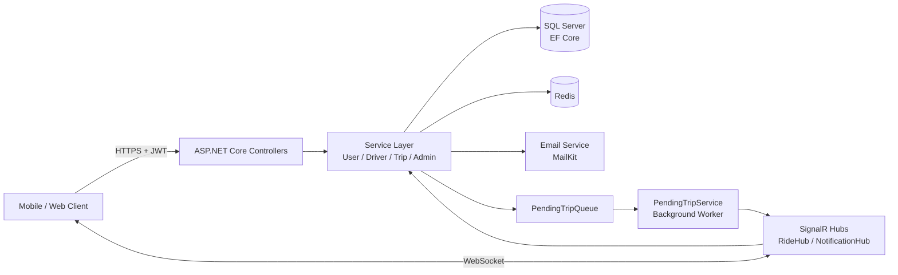
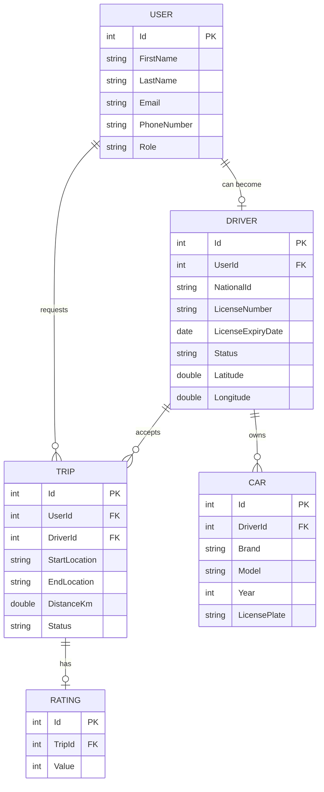

# 🚕 Taxiiii — Ride-Hailing REST API

A backend for a ride-hailing platform (Uber-style) built with **ASP.NET Core**. It supports three roles (Rider, Driver, Admin), real-time trip updates with **SignalR**, driver onboarding with admin approval (KYC), and a full trip lifecycle.

**🔗 Live API (Swagger):** https://taxii.runasp.net/swagger/index.html

---

## ✨ Features

**Authentication & Users**
- Register / login with **JWT**, plus **Google Sign-In**
- Forgot / reset password via email (MailKit)
- Profile management with image upload
- Role-based access: `User`, `Driver`, `Admin`

**Driver Onboarding (KYC)**
- Drivers apply with national ID, driving license, and selfie images
- Admin reviews and **approves / rejects** applications
- Drivers register their cars and set their availability status

**Trips**
- Rider creates a trip, sees **nearby drivers**, and selects one
- Driver accepts → starts → completes (or cancels with a reason)
- Rider can cancel and **rate the driver** after the trip
- Trip history for both riders and drivers

**Real-time**
- **SignalR** hubs (`RideHub`, `NotificationHub`) for live trip status, notifications, and driver location
- Background service with a **pending trip queue** to handle unassigned trips

**Admin**
- Manage users and drivers, review pending applications, view all trips

---

## 🛠️ Tech Stack

| Area | Technology |
|------|-----------|
| Framework | ASP.NET Core Web API (C#) |
| Database | SQL Server + Entity Framework Core |
| Cache | Redis (StackExchange.Redis) |
| Real-time | SignalR |
| Auth | JWT Bearer, Google OAuth |
| Email | MailKit |
| Background jobs | Hosted Service (`PendingTripService`) |
| Docs | Swagger / OpenAPI |
| Hosting | runasp.net |

---

## 🏗️ Architecture



**Project structure**

```
Taxiiii/
├── Controllers/     # API endpoints
├── Services/        # Business logic
├── Interfaces/      # Service contracts
├── Models/          # EF Core entities
├── DtoS/            # Request / response DTOs
├── Data/            # DbContext
├── signalIR/        # SignalR hubs
├── EmailService/    # Email sending
├── ApiResponse/     # Unified response wrapper
└── Migrations/      # EF Core migrations
```

---

## 🗄️ ERD

> ⚠️ Draft — adjust entity and field names to match your `Models` folder.



---

## 🚀 Getting Started

### Prerequisites
- [.NET SDK](https://dotnet.microsoft.com/download)
- SQL Server
- Redis instance

### 1. Clone
```bash
git clone https://github.com/ahmedgamal261021-svg/Taxi.git
cd Taxi
```

### 2. Configure secrets
Never commit real secrets. Use **User Secrets** locally:

```bash
dotnet user-secrets init
dotnet user-secrets set "JWT:Key" "<a-long-random-secret>"
dotnet user-secrets set "ConnectionStrings:MyConnection" "<sql-server-connection-string>"
dotnet user-secrets set "Redis:ConnectionString" "<redis-connection-string>"
dotnet user-secrets set "GoogleAuth:ClientId" "<google-client-id>"
dotnet user-secrets set "EmailSettings:FromEmail" "<email>"
dotnet user-secrets set "EmailSettings:Password" "<app-password>"
```

### 3. Apply migrations & run
```bash
dotnet ef database update
dotnet run
```

Open Swagger at `https://localhost:<port>/swagger`.

---

## 🔑 Try It

1. Open the [live Swagger](https://taxii.runasp.net/swagger/index.html)
2. Register via `POST /api/User/register`, then log in via `POST /api/User/login`
3. Click **Authorize** and paste `Bearer <your token>`

**Demo account**

| Role | Email | Password |
|------|-------|----------|
| Rider | `demo.rider@example.com` | `<password>` |
| Admin | `demo.admin@example.com` | `<password>` |

> Fill these with demo accounts only, never real credentials.

---

## 🗺️ Main Endpoints

| Group | Examples |
|-------|----------|
| User | `POST /api/User/register`, `POST /api/User/login`, `POST /api/User/google-login`, `GET /api/User/GetNearbyDrivers` |
| Trip | `POST /api/Trip/createTrip`, `GET /api/Trip/myTrips`, `GET /api/Trip/history` |
| Driver | `POST /api/Driver/apply`, `PUT /api/Driver/accept-trip/{tripId}`, `PUT /api/Driver/StartTrip`, `PUT /api/Driver/CompleteTrip` |
| Admin | `GET /api/Admin/GetAllDrivers`, `PUT /api/Admin/ApprovedDriver`, `PUT /api/Admin/RejectedDriver` |

Full documentation is available in Swagger.

---

## 🧭 Roadmap

- [ ] Unit and integration tests (xUnit)
- [ ] Docker + docker-compose
- [ ] CI with GitHub Actions
- [ ] Fare calculation on the server
- [ ] Pagination on list endpoints
- [ ] Rate limiting and global exception handling

---

## 👤 Author

**Ahmed Gamal**
GitHub: [@ahmedgamal261021-svg](https://github.com/ahmedgamal261021-svg)
